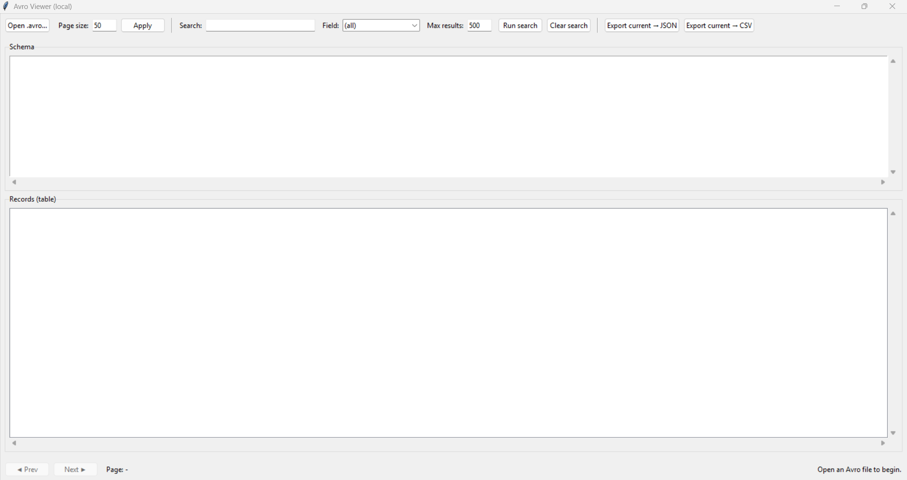

# Avro Viewer (local)

A small local GUI app to inspect `.avro` files:
- shows embedded **schema**
- displays records in a **table**
- **page** through records (Prev/Next)
- **search** across all fields or by a selected field
- export current view to **JSON** or **CSV**
- double-click a row to open the full record as **pretty JSON**

## Requirements
- Python 3.10+ recommended
- Tkinter (usually included with Python on Windows/macOS; on Linux install `python3-tk`)
- fastavro

## Run
```bash
python main.py
```

## Notes about big files
- Paging uses a simple approach: it re-opens the file and skips records to the needed page.
  This is reliable and memory-friendly, but going far back/forward in huge files can be slower.
- Search scans the file sequentially and returns up to **Max results** matches.

## Screenshots

Main view
